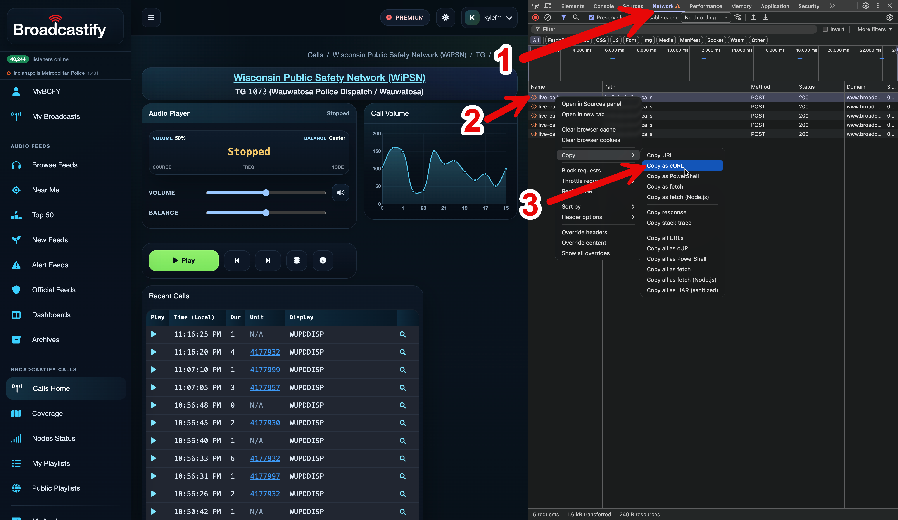
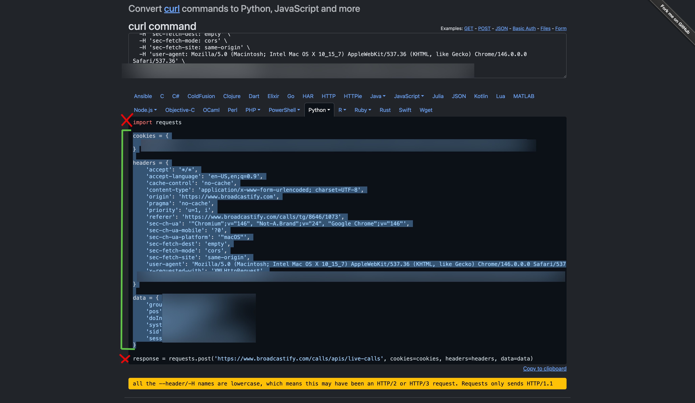

# radio_recorder

These scripts are intended to assist with recording radio communications from a broadcastify.com live feed. 

It will require you to keep the script running continuously, although the resource requirements of this are very low. 

<details>
  <summary>Quick note on `uv`, if you know what `uv` is, skip this</summary>
  <br>
  This project is set up to use `uv`, a convenient way to manage Python, which can otherwise be unwieldy for reasons I won't get into here. 

  The gist is that you should install `uv` by following the [instructions here](https://docs.astral.sh/uv/getting-started/installation/)

  Regrettably, this and most of the ways to use this project involve interacting with the command line. Sincerely, I wish it didn't. If this is a barrier to you using this program, I apologize. Let me know on [bsky](https://bsky.app/profile/assf.art) or [via Signal](https://signal.me/#eu/d9FFpkWRjiWLpfXKmvST1U2_hZyFOOKCro0f-NuPadwhyO3DotFKco1ZQ208NBd9), if there's enough demand, I can try to make this into a more user-friendly app. 
</details>

## USAGE:
You will need a free broadcastify.com login. [Sign up here](https://register.radioreference.com/) (even though the domain doesn't match, this is broadcastify.com's official sign up page) then login on broadcastify.com with your new account

Head to the page for the specific feed you'd like to record. [We'll use Wauwatosa PD as an example](https://www.broadcastify.com/calls/tg/8646/1073) 

Open your browser's developer tools, these instructions are for Chrome, but will be very similar on others. An easy way to do this is to right click on an empty part of the page and choose "Inspect" 

Then, you'll want to: 
1. Select the "Network" tab
2. Right-click on any of the entries that says "live-calls"
3. Navigate to Copy>Copy as cURL (if you're on Windows, choose "Copy as cURL (bash)")


Now head to [CurlConverter](https://curlconverter.com), paste what you've just copied into the main text box of the site, and copy every line of the output except for the first and the last (see the green line in screenshot:)


Finally! Go to main.py and replace this:

```
cookies = {
    # MUST SUPPLY YOUR OWN, see README.md
}

headers = {
    # MUST SUPPLY YOUR OWN, see README.md
}

data = {
    # MUST SUPPLY YOUR OWN, see README.md
}
```

with what you've just copied. That's it! You did it! 

Run `uv run main.py` and as long as you keep this window/session open, it will record all of the audio from your chosen feed. This is stored as mp3 files in the `calls/` folder, with each .mp3 file representing a single radio broadcast transmission.

`concat.py` is offered as a convienent way to manage these files. It will turn your folder of (potentially thousands of) .mp3 files into one, maintaining the correct order that the transmissions initially were broadcast. 

<br><br>

I almost forgot! You don't need to do anything about this/configure this, but I should mention that by default, every day at midnight local time, this script will generate an mp3 file that contains a computerized voice saying the following (imagine it's 12:01am on a Saturday April 11th): 

```
"This concludes Friday, April 10th. It is currently 12:01am on Saturday, April 11th". 
```

The reason for this is because when I had weeks/months worth of mp3 files, once the files got concatenated into a single .mp3 file, it was challenging to figure out time periods unless you could get lucky with context clues. 
